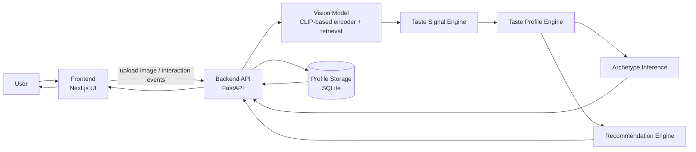

# BiteMe

BiteMe is an AI-powered food taste discovery app. Users upload food photos, and the system predicts dishes, converts those predictions into taste signals, and builds a live taste profile over time. The app also assigns a food archetype and uses the profile to generate restaurant recommendations and taste-compatibility matches with other users. The demo is designed to show how image-based signals and user interactions (like recommendation clicks) continuously reshape the profile.

## Product Overview

From the user perspective, BiteMe is a simple loop:

- Upload a food image.
- The AI predicts likely dishes from the image.
- The app updates a taste profile (cuisines, dishes, and taste dimensions).
- The app assigns/updates an archetype as a short summary of current taste behavior.
- The updated profile powers restaurant matches and user compatibility matches.

The profile is not static. As users upload more images and interact with recommendations, BiteMe updates taste signals and recomputes summary outputs (including archetype and downstream recommendations).

## Demo Overview

The demo flow is:

1. User uploads a food image.
2. Vision inference predicts dish candidates.
3. Predicted dish signals are mapped to taste traits/dimensions.
4. Taste profile is updated and persisted.
5. Archetype is recomputed from the updated profile.
6. Restaurant recommendations and compatibility matches are returned and rendered in the UI.

## System Architecture

Architecture diagram: [`docs/system_architecture.md`](docs/system_architecture.md)

The diagram below illustrates the end-to-end system flow from user interaction through AI inference, taste profile updates, and recommendation generation.

At a high level, the Next.js frontend sends uploads and interaction events to a FastAPI backend. The backend runs vision/retrieval inference, converts predictions into taste signals, updates the user profile in storage, recomputes archetype and recommendation outputs, and returns the latest state to the frontend. Storage is currently SQLite-based for local/demo persistence.



## AI Component Overview (Model Card Summary)

A full model card for the AI system is available at: `docs/model_card.md`.

### Model Type

CLIP-based vision embedding pipeline that converts images into embeddings and uses embedding retrieval with reranking to predict likely dishes. These predictions are then converted into structured taste signals that drive the profile, archetype, and recommendation logic.

### Role in the Product

The AI layer identifies dish signals from uploaded food images and feeds those signals into profile, archetype, and recommendation logic.

### Inputs

- User-uploaded food images.
- Optional interaction signals (for profile evolution), such as clicked recommendations.

### Outputs

- Dish predictions (top candidates + confidence-like scores).
- Structured taste signals used by downstream profile/archetype/recommendation modules.

### Data

Model development/evaluation workflows in this repository reference food datasets such as Food101 and UECFood256, plus local manifests built from those sources.

### Evaluation

The repository includes evaluation utilities for retrieval/rerank behavior and prediction sanity checks (for example under `utils/`). In practice, quality is assessed by dish prediction correctness, retrieval/rerank behavior, and whether profile/recommendation outputs align with observed user food behavior.

### Limitations

- Visually ambiguous dishes can be misclassified.
- Similar-looking foods can collapse into nearby classes.
- Dataset composition can bias performance toward better-represented cuisines/styles.
- Closed-set retrieval can be brittle for unusual dishes or non-food images (mitigated by non-food rejection logic).

### Improvement Path

Reasonable next steps include larger and more balanced food datasets, stronger fine-tuning and calibration, richer multimodal features, and expanded user-feedback loops for continuous correction.

## ML System Notes

The codebase separates model inference, profile/recommendation business logic, and evaluation utilities.  
Runtime inference and product behavior are orchestrated through the FastAPI + Next.js production path.  
Model-serving and prediction modules live in `models/` and backend orchestration lives in `api/`.  
Training/evaluation/diagnostic helpers are kept separately under `utils/` as support workflows.  
This separation allows model iteration and evaluation changes without requiring frontend interface changes.

## Repository Structure

```text
api/
  FastAPI backend including profile updates, archetype logic, and recommendation endpoints.

frontend/
  Next.js UI for onboarding, uploads, profile exploration, and recommendations.

models/
  Runtime model inference modules (vision encoding, retrieval, reranking helpers).

scripts/
  Operational scripts used for demo setup (for example demo user seeding).

utils/
  Training/evaluation/diagnostic utilities and data-prep workflows.

archive/
  Archived legacy/manual artifacts retained for reference.
```

## Installation

Backend:

```bash
pip install -r requirements.txt
uvicorn api.main:app --reload --port 8000
```

Frontend:

```bash
cd frontend
npm install
npm run dev
```

Expected local endpoints:

- Frontend: `http://localhost:3000`
- Backend API: `http://127.0.0.1:8000`
- API docs: `http://127.0.0.1:8000/docs`

## Running the Demo

1. Start backend server (`uvicorn api.main:app --reload --port 8000`).
2. Start frontend server (`cd frontend && npm run dev`).
3. Open `http://localhost:3000`.
4. Enter email + username on the welcome screen.
5. Upload a food image.
6. Observe updated taste profile, archetype, matches, and restaurant recommendations.

Optional demo seed flow:

```bash
python scripts/seed_demo_users.py --reset_existing_demo
```

## Expected Outputs

A grader should see:

- Dish prediction results after upload.
- Updated taste dimensions and trend history.
- A current archetype summary tied to profile state.
- Compatibility matches (`why_you_match` style explanations).
- Restaurant recommendations with score breakdown/action metadata.

## Dataset Information

The full datasets used for development are not stored in this repository because they contain large numbers of images and assets.

- The project uses food image datasets for model development and evaluation.
- The full raw datasets are excluded from this repository due to size.
- The demo runs using pretrained model artifacts and lightweight local assets included in this repository, so a grader can run the system without downloading the full datasets.

Datasets referenced by workflows include:

- Food101
- UECFood256

To reproduce the full training/data pipelines, those datasets should be obtained from their official sources and connected through the utilities in `utils/`.

## Demo Video

Demo Video:  
In Submission Folder

## Security and Environment Notes

- Never commit API keys or secrets.
- Store environment-specific values in `.env` files.
- `.gitignore` is used to prevent sensitive/local artifacts from being committed.

## Production vs Demo

This repository is a working proof-of-concept and demo-ready implementation.

A production deployment would typically add:

- scalable model serving and monitoring
- hardened persistent databases and migrations
- production recommendation/data pipelines
- deployment infrastructure, access controls, and observability
