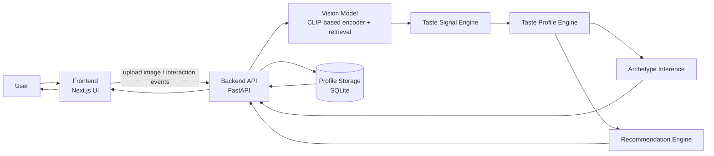

# BiteMe System Architecture

BiteMe runs as a two-tier product application: a Next.js frontend for user interaction and a FastAPI backend for inference, profile updates, and recommendation computation. The backend calls the vision/retrieval stack to convert uploaded food images into dish candidates, then translates those candidates into taste signals that update a persistent user profile.

Archetype inference and recommendation ranking are derived from the evolving taste profile rather than being computed directly in the frontend. After each material interaction (for example image upload or recommendation click), the backend recomputes profile-derived outputs, persists state, and returns the latest profile package for rendering in the frontend.
